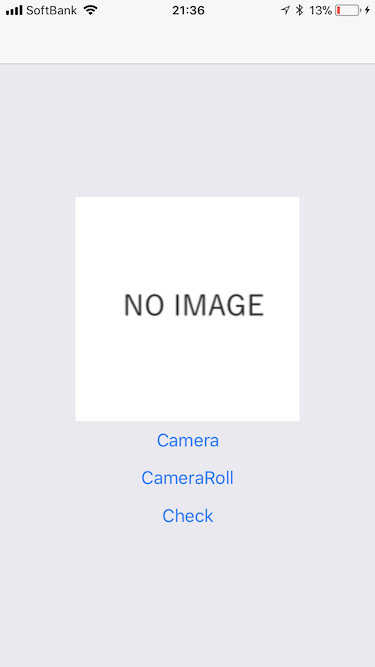
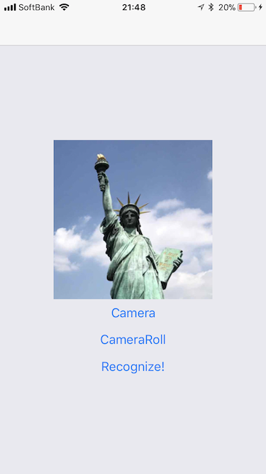

# react_native_image_recognition_app
react native app for image recognition (sample)

# server

## 概要

1. clientから送られた（base64エンコードされた）画像を`numpy.ndarray`形式に変換します。
2. `numpy.ndarray`の`shape`をクライアントに返します。
  * sklearnなりkerasなりを使った画像認識APIに改変することを想定しています

## deploy方法

* 適当なクラウドサービスにPCFでデプロイすることを想定しています。

# client

## 概要

## build

* [expo.io](https://expo.io/)でBuildすることを想定しています。

## screen shot

